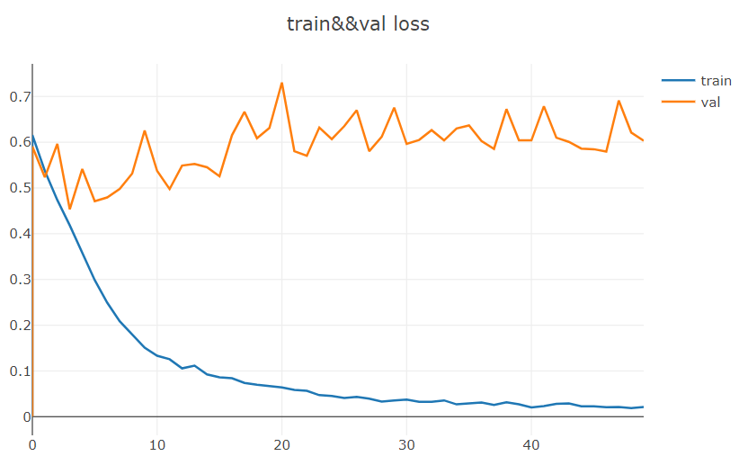
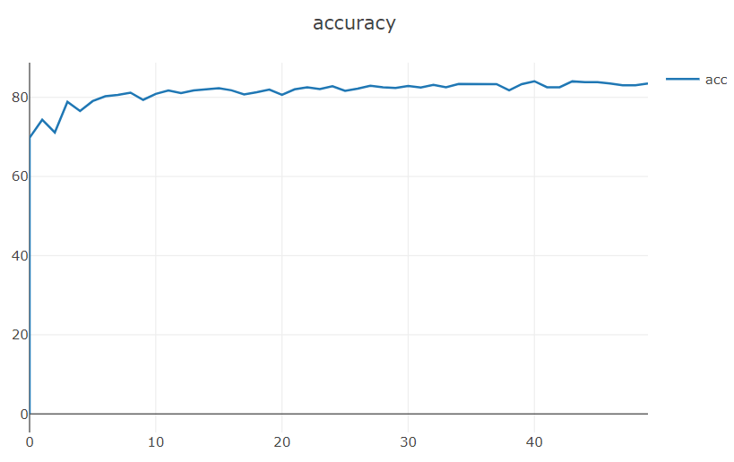
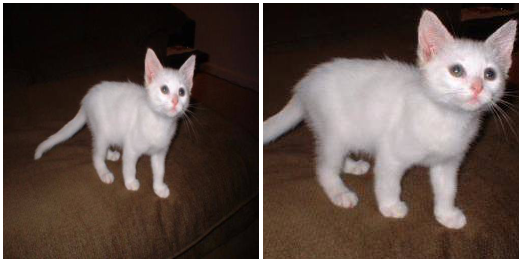
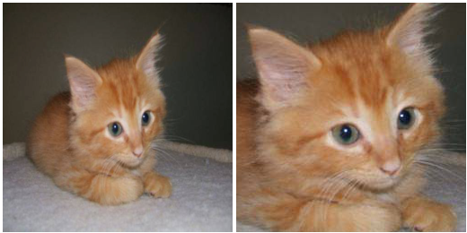

# SKNet
SKNet是由SK Module模块堆叠而成的neural network。该network的neural unit具备了select kernel的function。该function来源于人类的视觉神经元。这种操作与inception net的多分支操作类似，而且inception net也能够实现select kernel的function。当kernel中对应某一分支的feature map的权重不为0，而且则全为0时，神经元也具备了select kernel的function。但是与inception net的机制不同，SKNet的select kernel function能够根据其Input来自适应决定。所以说，inception net的select kernel function是静态的，而SKNet的select kernel fuunction是动态的。同时，inception net的select kernel function是隐式的，而SKNet的select kernel function是显式的。
# Environment
python 3.7    
pytorch 1.5    
torchvision 0.6    
opencv 3.4  
# Experiment
我同样使用猫狗数据集来训练sknet。模型的learning_cure和accuracy曲线下图所示。
  
  
之后，我从测试数据中sample了一张图像，并将图像进行放大来查看sknet某一sk module中的5x5分支的attention的变化。  
  
  
从channel_attention的变化中可知，对于原始图像，5x5 branch的注意力值较大，而对于放大图像，其5x5 branch的注意力值较小。这与作者的原意相反。对于object较大的图像，模型的5x5 branch的注意力值应该较大，这表明了神经元更多地选择了来自于较大感受野分支的信息。出现以上原因有可能是因为模型的泛化能力不足，从learning_cure中可知，模型存在着过拟合。因此，我从训练集中sample了另一张图像，并对其放大来观察attention value的变化。如下图所示：  
  
  
这很好地说明了，经过训练，模型已经具备了能够根据Input来挑选不同感受野的信息。但是此时，我也有一个疑问，为什么对于object较大的图像，神经元会选择感受野较大的信息，而不是感受野较小的信息。这是因为对于大object使用小kernel是否能够捕捉到更好地细节信息，而使用大kernel是否会遗漏某些细节信息。对于小object同样，使用大kernel使得网络能够更快地捕获到object的位置，而使用小kernel需要花费更多的时间。
